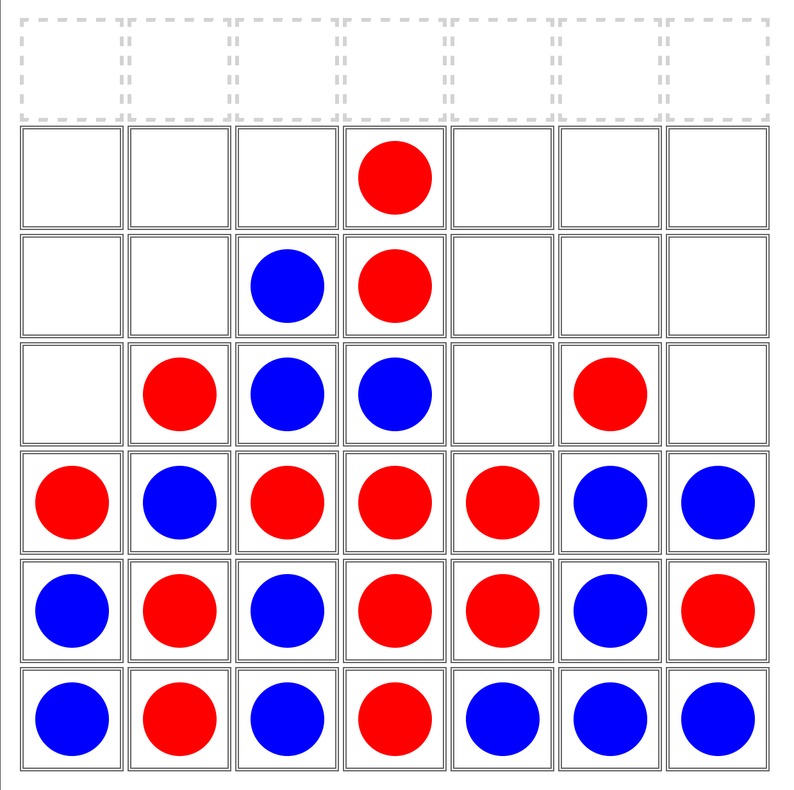

# Connect 4 Project

This is a public repo of my Connect 4 Project Demo that i helped to complete with the addition of a little bit of html, some css, and some core logic in javascript.
The Live webpage for this game is using [GitHub Pages](https://pages.github.com/)

## How To Play

When you run the html file or open the hosted page, you will see the connect 4 board. Currently the board is a 6x7 grid of 50x50 pixel squares. At the top of the board, with what look like boxes with dashed outlines, is the area where you can click to drop a piece down the desired column selected column.

2 players alternate placing pieces down on the board. The first player to get 4 in pieces in a row horrizontaly, vertically or diagonally wins the game. If the board fills up and no player was able to get 4 in a row, the game ends in a tie/draw.

Click **[>here<](https://papontem.github.io/15Connect4_Public_Demo/)** to start the game within github pages.

## ToDo:
This is a list of things i'd like to implement as i get better at software development.

1. Animations for the pieces dropping down from the top of the boardto the bottom of the column.

2. Adding a menu before the game starts that  will lets users customize their game experience.
    Among some of the settings id like to implement.
    - Change the height and width of the board
    - Choice of colors for player pieces
    - Choice to add an img to player pieces
    - Change game background to any preffered img

3. Add functionality for resetting the game once an end game or tie game state is reached. 

        